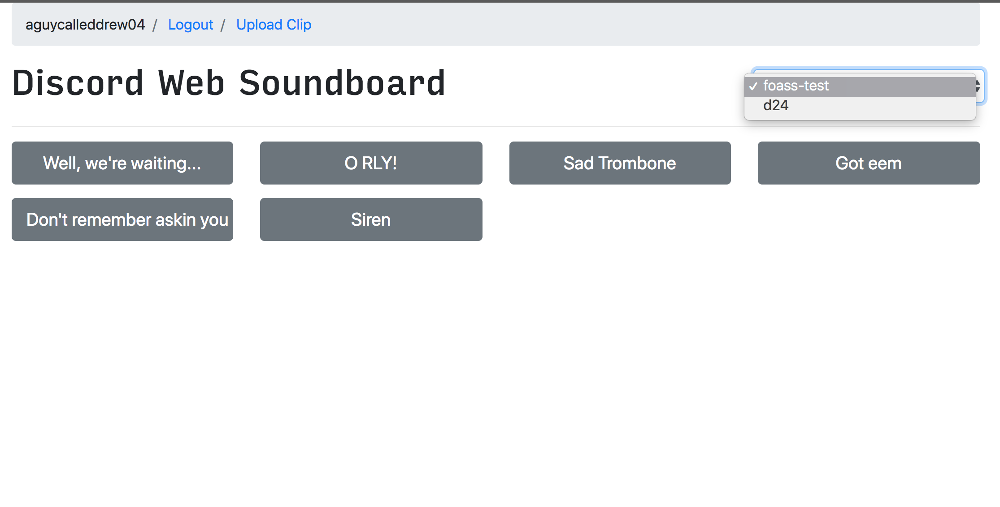
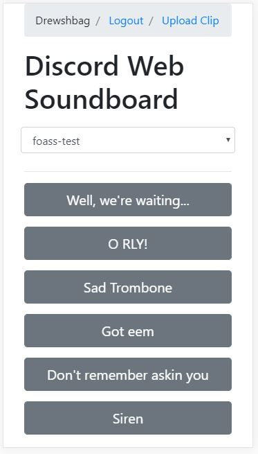

# Discord Web Soundboard

UNDER DEVELOPMENT

A simple web-based Discord soundbard bot with a response UI. Can be used on any device with a web browser. UI is still a work in progress. 

## Authentication

Authentication is via Discord oAuth2 provider. You will only be able to upload/play clips for Guilds that you belong to. 

## Database Setup

TBD

## Docker Deployment

TBD

TODO:
-----

- [ ] Get rid of the noobish prtinln everywhere and do propper logging
- [ ] Landing page with styling
- [ ] Update styling for clip board  
- [ ] Update loadSoundBuffer to pass a channel to opus handler
- [ ] Track a clip's creator, allow for clip deletion 
- [ ] Look into object storage and it's effect on playback performance
- [ ] Convert input MP3 in memory instead of subprocess call to FFMPEG
